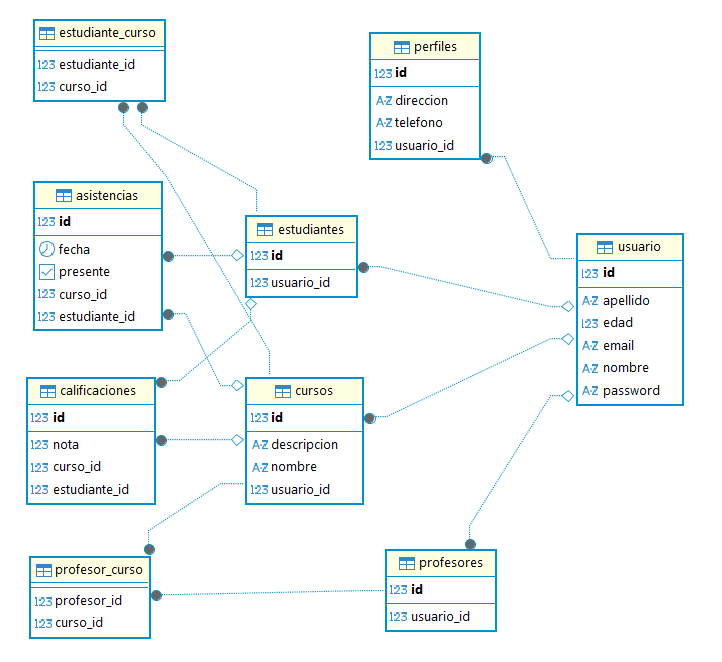

# EduPerformance

EduPerformance es una API REST para la gestion academica de estudiantes, profesores, cursos, calificaciones y asistencias. El proyecto centraliza informacion academica, aplica reglas de negocio en el backend y expone servicios listos para ser consumidos por aplicaciones web o moviles.

## Planteamiento del problema

En muchos entornos academicos la informacion de estudiantes, docentes, cursos, notas y asistencias se administra en herramientas separadas o de forma manual. Esto dificulta el seguimiento oportuno del rendimiento, aumenta el riesgo de inconsistencias y reduce la capacidad de profesores y estudiantes para consultar informacion actualizada.

EduPerformance propone una solucion backend organizada y escalable que permite administrar estos procesos desde una API unica, con validaciones de negocio, persistencia relacional, documentacion interactiva y soporte para despliegue en la nube.

## Objetivos

**Objetivo general**

Desarrollar una API backend robusta con Spring Boot que soporte la gestion academica universitaria de manera eficiente, mantenible y preparada para integrarse con clientes web o moviles.

**Objetivos especificos**

- Implementar una arquitectura multicapa basada en Controller, Service, Repository y Entity.
- Gestionar usuarios, perfiles, estudiantes, profesores, cursos, calificaciones y asistencias mediante endpoints REST.
- Aplicar reglas de negocio para proteger la integridad de calificaciones, asistencias y relaciones academicas.
- Documentar la API con Swagger/OpenAPI y una coleccion de Postman.
- Preparar el proyecto para ejecucion local, contenedores Docker y despliegue en Render con PostgreSQL.

## Integrantes del proyecto

| Integrante |
|------------|
| Sergio Aterhortua |
| David Marin |
| Yeison Angel |
| Alison Diaz |
| Carolina Martinez |

## Tecnologias principales

- Java 21
- Spring Boot 4.0.3
- Spring Web MVC
- Spring Data JPA / Hibernate
- Spring Validation
- Spring Security
- PostgreSQL
- Lombok
- Swagger / OpenAPI con Springdoc
- Scalar API Reference
- Docker
- Render
- Maven
- Postman

## Modulos implementados

- **Usuarios:** datos base de acceso e identificacion.
- **Perfiles:** informacion complementaria del usuario, como direccion y telefono.
- **Estudiantes:** vinculacion del usuario con rol academico de estudiante.
- **Profesores:** vinculacion del usuario con rol docente.
- **Cursos:** creacion y administracion de cursos con profesor asignado.
- **Calificaciones:** registro de notas, consulta por estudiante y curso, y calculo de promedio.
- **Asistencias:** registro de asistencia por estudiante, curso y fecha.

## Reglas de negocio destacadas

- Las calificaciones solo se aceptan en el rango de `0.0` a `5.0`.
- El promedio de calificaciones se calcula desde las notas registradas para un estudiante en un curso.
- No se permite registrar asistencias con fechas futuras.
- Los errores de negocio se responden en formato JSON mediante un manejador global de excepciones.
- Las respuestas usan DTOs para evitar exponer directamente relaciones internas o generar ciclos de serializacion.

## Arquitectura

El proyecto sigue una arquitectura por capas:

- **Controller:** expone endpoints REST bajo rutas `/api/*`.
- **Service:** concentra la logica de negocio, validaciones y conversion entre entidades y DTOs.
- **Repository:** accede a la base de datos mediante Spring Data JPA.
- **Entity:** define el modelo relacional con anotaciones JPA.
- **DTO:** separa los datos de entrada y salida de las entidades persistidas.
- **Exception:** centraliza respuestas de error con `GlobalExceptionHandler`.
- **Config:** contiene configuraciones de CORS, seguridad y OpenAPI.

## Diagrama de base de datos

El modelo relacional del proyecto se encuentra documentado en la carpeta `doc`.



## Endpoints principales

| Recurso | Ruta base | Operaciones |
|---------|-----------|-------------|
| Usuarios | `/api/usuarios` | CRUD |
| Perfiles | `/api/perfiles` | CRUD |
| Estudiantes | `/api/estudiantes` | CRUD |
| Profesores | `/api/profesores` | CRUD |
| Cursos | `/api/cursos` | CRUD |
| Calificaciones | `/api/calificaciones` | CRUD, consulta por estudiante/curso, promedio |
| Asistencias | `/api/asistencias` | CRUD, consulta por curso/fecha |

Endpoints especiales:

- `GET /api/calificaciones/estudiante/{estudianteId}/curso/{cursoId}`
- `GET /api/calificaciones/promedio/estudiante/{estudianteId}/curso/{cursoId}`
- `GET /api/asistencias/curso/{cursoId}/fecha/{fecha}`

## Documentacion y pruebas de API

Al ejecutar el proyecto localmente, la documentacion interactiva queda disponible en:

- Swagger UI: `http://localhost:8080/swagger-ui.html`
- OpenAPI JSON: `http://localhost:8080/api-docs`

Tambien se incluye una coleccion de Postman para probar el CRUD completo:

- [`doc/EduPerformance_CRUD_Completo_Postman.json`](./doc/EduPerformance_CRUD_Completo_Postman.json)
- [`doc/Guia_Uso_CRUD_Postman.md`](./doc/Guia_Uso_CRUD_Postman.md)

## Guia de ejecucion local

1. Clonar el repositorio.

```bash
git clone <url-del-repositorio>
cd ProyectoIntegrador-Segunda-entrega-Moviles02
```

2. Crear un archivo `.env` en la raiz del proyecto con las variables de PostgreSQL.

```properties
DB_URL=jdbc:postgresql://localhost:5432/eduperformance
DB_USERNAME=postgres
DB_PASSWORD=tu_password
```

3. Ejecutar el proyecto con Maven.

```bash
./mvnw spring-boot:run
```

En Windows tambien se puede usar:

```powershell
.\mvnw.cmd spring-boot:run
```

4. Abrir Swagger UI.

```text
http://localhost:8080/swagger-ui.html
```

## Ejecucion con Docker

El proyecto incluye un `Dockerfile` con compilacion en dos etapas:

```bash
docker build -t eduperformance-api .
docker run -p 8080:8080 --env-file .env eduperformance-api
```

## Despliegue

El archivo `render.yaml` define el despliegue como servicio web Docker en Render y una base de datos PostgreSQL administrada. Las variables `DB_URL`, `DB_USERNAME` y `DB_PASSWORD` se toman desde la base de datos configurada en Render.

## Documentacion tecnica

La explicacion tecnica ampliada se encuentra en:

- [`doc/Explicacion_Tecnica_EduPerformance.md`](./doc/Explicacion_Tecnica_EduPerformance.md)

